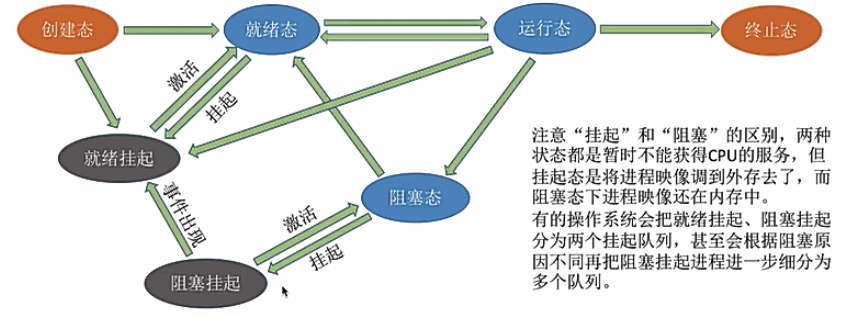
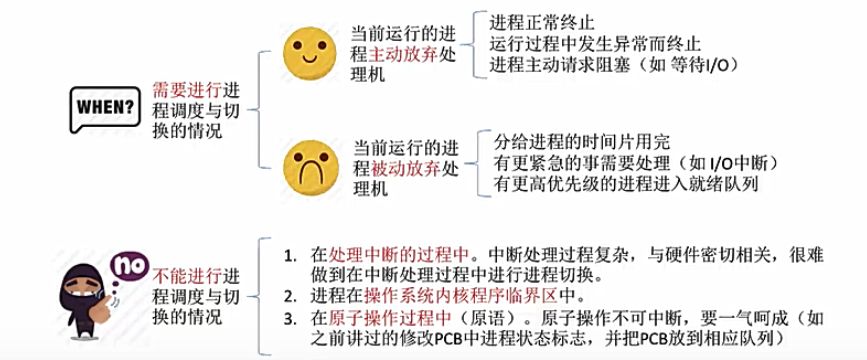

# CPU调度
## 调度的基本概念
### 1.调度
调度的研究问题：当有一堆任务要处理，但由于资源有限，这些任务无法同时处理，这就需要确定按某种规则来决定处理这些任务的顺序

在多道程序系统中，进程的数量(任务数量)往往是多于处理机（资源）的数量的，所以需要进行CPU调度

某种调度规则就是按照一个算法来进行调度

CPU调度/进程调度：按照**某种算法**选择一个进程将**处理机**分配给它

### 2.调度的三个层次
1. 高级调度/作业调度/长程调度：外存调入内存并初始化PCB

    决定了多道程序处理的**道**，长程调度需要融合IO型进程和CPU型进程，让IO设备和CPU的利用率都理想
    
2. 中级调度/内存调度/中程调度：为缓和内存紧张问题，减轻系统负载，提高系统利用率，将外存的进程映像调回内存，注意进程的PCB始终保存在内存中
    
3. 低级调度/进程调度/短程调度：就绪队列选取进程分配CPU
    

三种调度的对比

补充：进程的挂起状态（suspend），挂起状态又可分为两种
+ 就绪挂起
+ 阻塞挂起

## 进程调度的时机与方式
### 1. 进程调度与切换的时机
进程调度：也称低级调度，就是按照某种算法从就绪队列中选择一个进程为其分配处理机

需要进程进程调度与切换的情况：
+ 当前获得cpu的进程**主动放弃**处理机
+ 当前获得cpu的进程**被动放弃**处理机

注意：进程在**操作系统内核程序临界区**中不能进行处理机调度与切换，而进程处于普通资源临界区时是**应该进行处理机调度**的

比如IO设备的临界区，如果不能进行处理机调度，则进程一直霸占着cpu，导致cpu一直空闲着，导致cpu利用率降低

### 2.进程调度的方式
+ **非抢占式**：**只允许进程主动放弃处理机**，在运行过程中即便有更紧急的任务到达，当前进程依旧使用处理机，直到该进程终止或主动要求进入阻塞
+ **抢占式**：当有一个更重要的进程需要处理机/时间片到，则**立即暂停正在执行的进程，剥夺该进程分配的cpu**，进行进程调度

非抢占式实现简单，系统开销小但是无法及时处理紧急任务

而抢占式可以处理更紧急的进程，也可以使得进程按照时间片轮流执行（通过时间中断）

**抢占式的进程调度适合用于实时操作系统**

### 3.进程的切换与过程
+ 狭义的进程调度：从就绪队列中**选择**一个要运行的进程
+ 进程切换：前一个进程**让出处理机**，另一个进程**占用处理机**
+ 广义的进程调度：包含选择一个进程和进程切换两个步骤

## 调度算法的评价指标

+ CPU利用率

    CPU“忙碌”的时间占总时间的比例，利用率 = 忙碌时间 / 总时间

    **在多道程序并发执行的情况，使用甘特图来辅助计算**

+ 系统吞吐量

    单位时间内完成作业的数量，吞吐量 = 总共完成了多少道作业 / 总共花费了多少时间

+ 周转时间
    
    周转时间是指从作业**被提交**给系统开始到**作业完成为止**的这段时间间隔
    
    周转时间：高级调出的时间 + 低级调度的时间 + 进程在cpu上执行的时间 + 进程等待IO分配与操作完成的时间
    
    + **周转时间** = 作业完成时间 - 作业提交给系统的时间
    
    + **平均周转时间** = 各作业周转时间之和 / 作业数

    + **带权周转时间** = 作业周转时间 / 作业实际运行的时间   --->  带权周转时间与周转时间都是越小越好，用户体验更好

+ 等待时间

    进程处于**等待处理机**状态时间之和，等待时间越长，用户满意度越低
    
    作业的等待时间还需要计算作业在外存后备队列进入内存等待的时间
    
+ 响应时间
    
    用户**提交请求**到**首次产生响应**所用的时间

