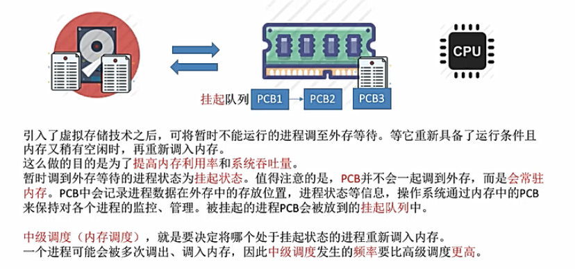

# CPU调度
## 调度的基本概念
### 1.调度
调度的研究问题：当有一堆任务要处理，但由于资源有限，这些任务无法同时处理，这就需要确定按某种规则来决定处理这些任务的顺序

在多道程序系统中，进程的数量(任务数量)往往是多于处理机（资源）的数量的，所以需要进行CPU调度

某种调度规则就是按照一个算法来进行调度

CPU调度：按照**某种算法**选择一个进程将**处理机**分配给它

### 2.调度的三个层次
1. 高级调度/作业调度/长程调度：外存调入内存并初始化PCB

    决定了多道程序处理的**道**，长程调度需要融合IO型进程和CPU型进程，让IO设备和CPU的利用率都理想
    
2. 中级调度/内存调度/中程调度：为缓和内存紧张问题，减轻系统负载，提高系统利用率，将外存的进程映像调回内存，注意进程的PCB始终保存在内存中
    
3. 低级调度/进程调度/短程调度：就绪队列选取进程分配CPU
    

三种调度的对比

补充：进程的挂起状态（suspend），挂起状态又可分为两种
+ 就绪挂起
+ 阻塞挂起

